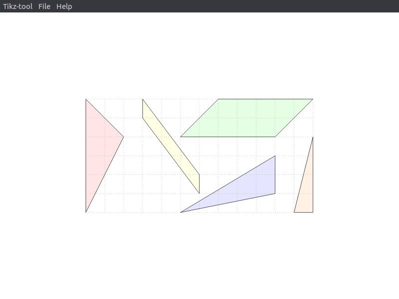
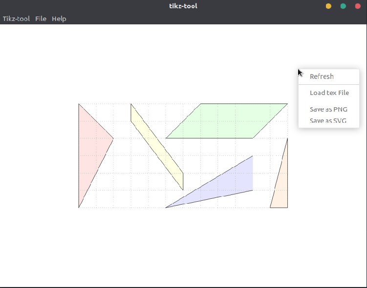
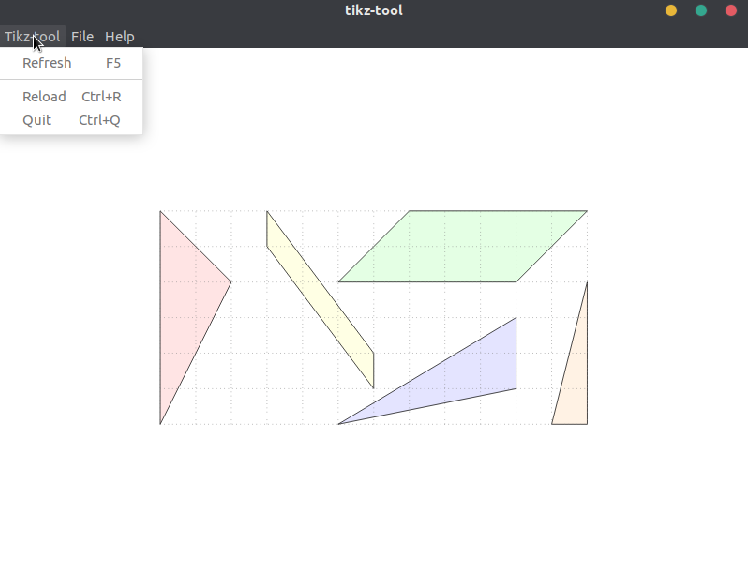
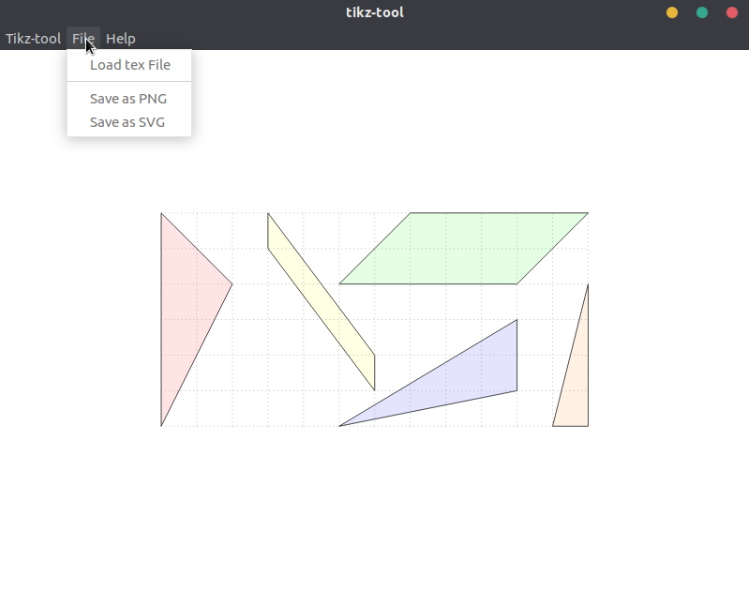

Tikz-tool
==========

Depends on 
- [tikzjax](http://tikzjax.com) 
- [electron](https://www.electronjs.org)

## Feature
- drap & drop
- save `.png` or `.svg`
- refresh when you are drawing

## Usage
For the first time:
```
npm install
```

If you want to start the tool, you can run
```
npm start
```

You can draw the graph in any `.tex` file, then load it, the tool surpport drap & drop. There are some examples in `./examples` folders, you can try them.

## Note     
- Maybe you need some time to download resource when you run the tool at the first time.
- There are many latex tikz features are not surpport

## Screenshot




